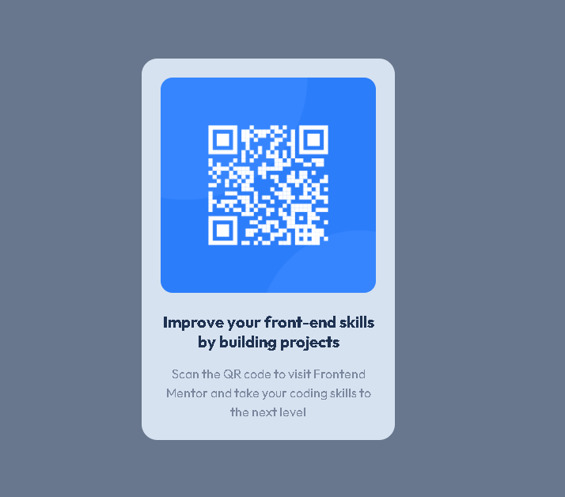

# Frontend Mentor - QR code component solution

This is a solution to the [QR code component challenge on Frontend Mentor](https://www.frontendmentor.io/challenges/qr-code-component-iux_sIO_H). Frontend Mentor challenges help you improve your coding skills by building realistic projects.

## Table of contents

- [Overview](#overview)
  - [Screenshot](#screenshot)
  - [Built with](#built-with)
  - [What I learned](#what-i-learned)
  - [Continued development](#continued-development)
  - [Useful resources](#useful-resources)
- [Author](#author)
- [Acknowledgments](#acknowledgments)

## Overview

This is a simple QR Code component built as part of a Frontend Mentor challenge.
This project helped me focus on practicing HTML and CSS fundamentals, including layout, spacing, and responsiveness.

### Screenshot

Above is the screenshot of my finished project.

### Built with

- HTML
- CSS
- CSS Flexbox
- A litte touch of media queries

### What I learned

I learned how to center elements using Flexbox and how to structure my HTML semantically.
I also improved my understanding of responsive design and image handling in CSS.
While working of this project, I discovered that it's not all about watching tutorials, the real deal comes when one decided to work on something and then, it feels like you know nothing. So to me, it's more practice with watching tutorials and then also problem solving.

### Continued development

In future projects, I want to improve my CSS layout skills before I start using JavaScript to add interactivity and functionality. I also plan to focus on responsiveness more seeing that it gave me a tough time.

### Useful resources

- MDN Web Docs – https://developer.mozilla.org/
- W3 School Docs – https://www.w3schools.com/
- These websites helped with the documentations I needed to get through the project.

## Author

- Name: Agbo Kizito C.
- GitHub: https://github.com/dubem014
- Frontend Mentor: https://www.frontendmentor.io/profile/Dubem014

## Acknowledgments

Thanks to Frontend Mentor for providing the challenge and helping me practice real-world projects.
